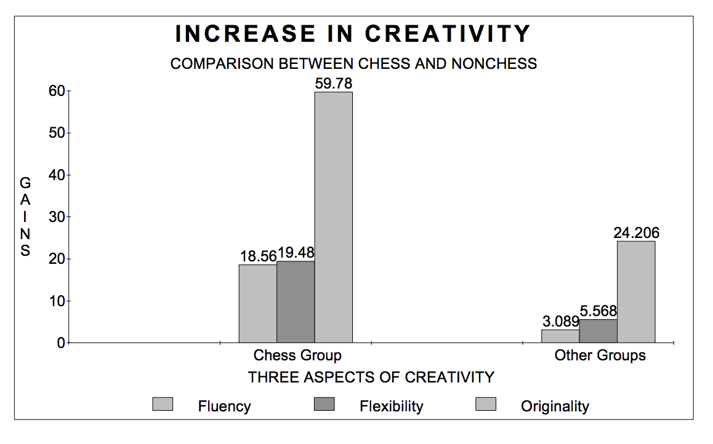
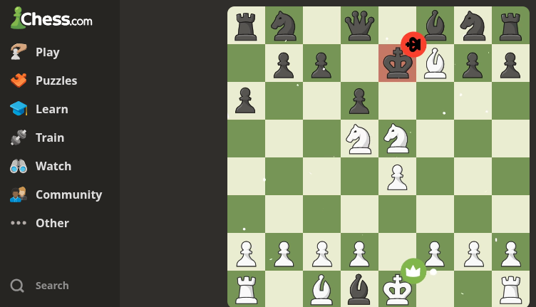

# CENTRO PAULA SOUZA #
# ETEC VASCO ANTONIO VENCHIARUTTI – JUNDIAÍ/SP #
# TÉCNICO EM DESENVOLVIMENTO DE SISTEMAS – JUNHO/2026 #

*Artigo desenvolvido na disciplina de Planejamento e Desenvolvimento do TCC em Desenvolvimento de Sistemas sob orientação dos professores Ronildo Aparecido Ferreira e Luciana Ferreira Baptista.*

## CURSO WEB PREPARATÓRIO PARA COMPETIÇÕES DE XADREZ: ORGANIZAÇÃO E TREINAMENTO ENXADRÍSTICO

**Adrian Morales Fernandes de Lima**
**Antonio Miguel Alves dos Santos**
**João Vitor Gomes Santos**

## RESUMO

Este estudo tem como objetivo desenvolver um curso web preparatório para competições de xadrez, visando auxiliar jogadores na organização de seus estudos e no aprimoramento de suas habilidades estratégicas. Dentre os autores pesquisados para a constituição conceitual deste trabalho, destacaram-se Reinfeld (1979) e Neto (2018), cujas obras apresentam fundamentos importantes para o ensino e treinamento enxadrístico. A metodologia utilizada foi a pesquisa descritiva, tendo como coleta de dados o levantamento bibliográfico e a análise de plataformas digitais voltadas ao ensino de xadrez. As conclusões mais relevantes indicam que a utilização de uma plataforma organizada e direcionada pode contribuir significativamente para a melhoria da preparação dos jogadores para competições, facilitando o acesso aos conteúdos, o acompanhamento do progresso e a prática orientada.

**Palavras-chave:** curso online; xadrez; preparação para competições; treinamento.

# INTRODUÇÃO

O xadrez é um jogo de estratégia amplamente reconhecido por estimular habilidades cognitivas como raciocínio lógico, concentração, memória e tomada de decisões. Além de sua relevância esportiva, o xadrez também possui aplicações educacionais, sendo utilizado em diferentes contextos para auxiliar no desenvolvimento intelectual dos praticantes. Com o avanço das tecnologias digitais e a popularização dos ambientes virtuais, o acesso ao aprendizado do jogo tornou-se mais amplo e acessível.

O presente estudo delimita-se ao desenvolvimento de um curso web preparatório para competições de xadrez, direcionado principalmente aos jogadores que necessitam de maior organização em seus estudos e treinamento. O foco do trabalho está na estruturação de conteúdos relacionados às fases do jogo, especialmente aberturas, meio-jogo e finais, além do acompanhamento do desempenho dos usuários.

O objetivo geral é desenvolver um curso web preparatório para torneios de xadrez, auxiliando os jogadores no aprimoramento de suas habilidades e na organização de seus estudos.

Esta pesquisa justifica-se pela dificuldade encontrada por muitos jogadores em estruturar seus estudos de forma eficiente. Embora existam diversas plataformas voltadas ao ensino do xadrez, nem sempre elas oferecem uma organização adequada para o treinamento competitivo. Dessa forma, a proposta busca contribuir para a melhoria do processo de aprendizagem e preparação dos enxadristas.

A metodologia adotada consiste em pesquisa descritiva, com levantamento bibliográfico, análise documental de plataformas digitais relacionadas ao xadrez e entrevistas com jogadores da escola.

# O XADREZ COMO FERRAMENTA DE DESENVOLVIMENTO COGNITIVO

O xadrez é considerado uma atividade que promove o desenvolvimento intelectual dos praticantes. Segundo Neto (2018), o aprendizado do jogo contribui para o aprimoramento do raciocínio lógico, da capacidade de planejamento e da resolução de problemas. Essas habilidades são constantemente exercitadas durante as partidas, exigindo análise, concentração e tomada de decisões.

Além disso, essas competências contribuem para o desenvolvimento da criatividade. A Figura 1 apresenta um gráfico referente a uma pesquisa da The American Chess School, realizada na década de 1980, comparando o desempenho em um teste de criatividade entre dois grupos de crianças com QI superior a 130.

<strong>Figura 1 – Gráfico de comparação do teste</strong> 
 
Fonte: Study I. The ESEA Title IV-C Project: Developing Critical and Creative Thinking Through Chess.

Além disso, a prática do xadrez estimula aspectos emocionais importantes, como o controle da ansiedade, a disciplina e a responsabilidade pelas próprias escolhas.

# PLATAFORMAS DIGITAIS E O ENSINO DO XADREZ

Nos últimos anos, o crescimento das plataformas digitais ampliou significativamente o acesso ao ensino do xadrez. Ambientes virtuais permitem que jogadores realizem partidas, resolvam exercícios e acompanhem seu desempenho por meio de recursos tecnológicos.

Plataformas como Lichess e Chess.com oferecem diversas funcionalidades voltadas ao aprendizado, incluindo análise de partidas, resolução de problemas táticos e acesso a conteúdos educacionais.

<strong>Figura 2 – Página inicial do Chess.com</strong> 
 
Fonte: Chess.com.

Apesar disso, muitos usuários ainda encontram dificuldades para estabelecer uma rotina organizada de estudos, especialmente quando o objetivo é a preparação para competições.

# DESENVOLVIMENTO DA PLATAFORMA WEB

O sistema proposto será desenvolvido como uma plataforma web voltada ao treinamento enxadrístico. A estrutura do curso será organizada em módulos que abordarão as principais áreas de estudo do jogo, incluindo aberturas, estratégias de meio-jogo, finais e exercícios práticos.

Além do conteúdo teórico, a plataforma contará com funcionalidades destinadas ao acompanhamento do desempenho dos usuários.

<strong>Figura 3 – Página inicial da plataforma</strong> 
 
Fonte: Elaborado pelos autores.

# TECNOLOGIAS UTILIZADAS

O desenvolvimento da plataforma está sendo realizado utilizando tecnologias amplamente empregadas na criação de sistemas web. A estrutura das páginas é construída com HTML, enquanto o CSS é utilizado para estilização visual. Para tornar a plataforma mais dinâmica e interativa, são empregados recursos da linguagem JavaScript.

O processamento das informações e a lógica principal do sistema são desenvolvidos em PHP. Além disso, a linguagem Python é utilizada para funcionalidades complementares e automação de processos. O armazenamento e gerenciamento dos dados são realizados por meio do sistema gerenciador de banco de dados MySQL.

Ressalta-se que parte das tecnologias descritas ainda está em fase de definição e poderá sofrer alterações durante o desenvolvimento do projeto.

# DISCUSSÃO E RESULTADOS

*Seção em desenvolvimento.*

# CONSIDERAÇÕES FINAIS

Este trabalho apresentou a proposta de desenvolvimento de um curso web preparatório para competições de xadrez, com foco na organização dos estudos e no aprimoramento das habilidades dos jogadores.

Os resultados esperados indicam que a plataforma poderá contribuir para a melhoria do desempenho dos usuários por meio de conteúdos estruturados, exercícios direcionados e acompanhamento do progresso.

Como continuidade do projeto, sugere-se a implementação de novos recursos, como análises automáticas de partidas, recomendações personalizadas de estudo e integração com plataformas enxadrísticas já consolidadas.

# REFERÊNCIAS

ALVES, Lynn; COUTINHO, Isa. **Jogos digitais e aprendizagem: fundamentos para uma prática baseada em evidências**. Salvador: EDUFBA, 2016.

NETO, Hélio. **Manual de xadrez: curso básico**. Brasil: Sesc – Serviço Social do Comércio, 2018. Disponível em: https://upload.wikimedia.org/wikipedia/commons/8/8b/Manual_xadrez.pdf. Acesso em: 28 mar. 2026.

REINFELD, Fred. **Manual completo de aberturas de xadrez**. São Paulo: Ibrasa, 1979. Disponível em: https://pt.scribd.com/document/577943064/Manual-Completo-de-Aberturas-de-Xadrez-Fred-Reinfeld. Acesso em: 30 mar. 2026.

SILVA, João Carlos. **Tecnologias digitais aplicadas ao ensino e aprendizagem**. São Paulo: Atlas, 2020.

STUDY I. The ESEA Title IV-C Project: Developing Critical and Creative Thinking Through Chess. Disponível em: https://www.geocities.ws/chess_camp/study_1.pdf. Acesso em: 14 jun. 2026.
